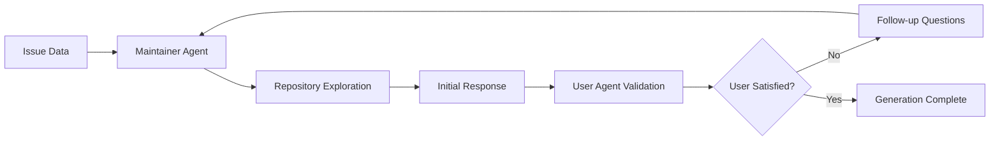
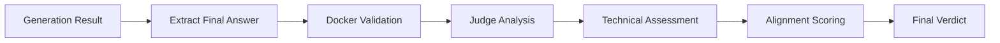

# 🚀 CodeAssistBench

[](https://www.python.org/downloads/)
[](https://www.docker.com/)
[](https://aws.amazon.com/bedrock/)

> **Code Assist Bench (CAB)** - Comprehensive toolkit for testing AI coding assistants on real-world programming problems

**CodeAssistBench** provides a complete framework for evaluating AI coding assistants through multi-agent workflows, Docker validation, and comprehensive metrics collection. Built for researchers, ML engineers, and developers who need robust, reproducible evaluation of code generation agents.

---

## 🎯 What CodeAssistBench Does

CodeAssistBench implements a sophisticated **three-agent evaluation framework** that simulates realistic developer interactions:

### **Multi-Agent Architecture**
- **🔧 Maintainer Agent**: Acts as experienced developer providing technical solutions
- **👤 User Agent**: Simulates end-users asking questions and validating responses  
- **⚖️ Judge Agent**: Evaluates solution quality and alignment with requirements
- **🔄 Interactive Workflows**: Multi-turn conversations with context awareness

###  **Docker Integration** 
- **Automated Validation**: Build and test solutions in isolated containers
- **Environment Reproducibility**: Consistent testing across different systems
- **Real-world Scenarios**: Test solutions in actual deployment environments
- **Safe Execution**: Isolated testing prevents system interference

### **Comprehensive Evaluation**
- **Technical Correctness**: Assess accuracy and completeness of solutions
- **User Satisfaction**: Measure alignment with original requirements
- **Performance Metrics**: Track conversation efficiency and resource usage
- **Detailed Reporting**: JSON-based results with rich metadata

---

## 🚀 Quick Start

### ⚡ **Setup**

```bash
# 1. Clone and setup
git clone https://github.com/amazon-science/CodeAssistBench.git
cd CodeAssisBench
python3 -m venv venv && source venv/bin/activate
pip install -e .
pip install -r requirements.txt
```

### 🎯 **One-Minute Working Example**

```python
import asyncio
from cab_evaluation import create_cab_evaluator
from cab_evaluation.utils.data_processor import DataProcessor

async def evaluate_agent():
    # Load issue from example file
    data_processor = DataProcessor()
    
    # Load from sample JSONL file  
    with open("examples/sample_dataset.jsonl", "r") as f:
        issue_dict = json.loads(f.readline())
    
    issue_data = data_processor.load_issue_data_from_dict(issue_dict)
    
    # Create evaluator with default models
    evaluator = create_cab_evaluator()
    
    # Run complete evaluation workflow
    result = await evaluator.run_complete_evaluation(issue_data)
    
    # Check results
    print(f"✅ User satisfied: {result.generation_result.user_satisfied}")
    print(f"🎯 Final verdict: {result.evaluation_result.verdict}")
    print(f"📊 Alignment score: {result.evaluation_result.alignment_score.percentage:.1f}%")
    print(f"💬 Conversation rounds: {result.generation_result.total_conversation_rounds}")

# Run the evaluation
asyncio.run(evaluate_agent())
```

**Expected Output:**
```
✅ User satisfied: True
🎯 Final verdict: CORRECT
📊 Alignment score: 87.5%
💬 Conversation rounds: 3
```

---

## Installation & Setup

### **Prerequisites**
- **Python 3.8+** (Python 3.9+ recommended)
- **Docker** (for container-based issue validation)  
- **AWS Account** (for Bedrock model access) *or* OpenAI API access
- **Git** (for repository operations)

### **Step 1: Environment Setup**

```bash
# Create isolated environment (STRONGLY recommended)
python3 -m venv venv
source venv/bin/activate  # On Windows: venv\Scripts\activate

# Verify Python version
python --version  # Should show Python 3.8+
```

### **Step 2: Install CodeAssistBench**

```bash
# Install from source (development)
git clone <repository-url>
cd CodeAssistBench
pip install -e .
pip install -r requirements.txt
pip install -e strands-1.12.0
pip install -e tools
```

### **Step 3: Configure Model Access**

#### **Option A: AWS Bedrock (Recommended)**
```bash
# Configure AWS credentials
aws configure
# Enter your AWS Access Key ID, Secret Key, and Region

# Verify Bedrock access
python -c "
import boto3
client = boto3.client('bedrock-runtime', region_name='us-east-1')
print('✅ AWS Bedrock configured successfully')
"
```

#### **Option B: OpenAI Models**
```bash
# Set OpenAI API key
export GPT_TOKEN="your-openai-api-key"

# Or create .env file
echo "GPT_TOKEN=your-openai-api-key" > .env
```

### **Step 4: Verify Installation**

```bash
# Test installation
python -c "
from cab_evaluation.agents.agent_factory import AgentFactory
from cab_evaluation.core.config import CABConfig
print('✅ CodeAssistBench installed successfully!')
print('🚀 Ready to evaluate agents!')
"

# Test Docker integration
docker --version  # Should show Docker version
docker ps  # Should connect without errors
```

---

## 📖 Usage Guide

### 🎮 **Basic Usage Patterns**

#### **1. Single Issue Evaluation**
```python
import asyncio
from cab_evaluation import create_cab_evaluator
from cab_evaluation.utils.data_processor import DataProcessor

async def evaluate_single_issue():
    # Load issue from JSON file
    data_processor = DataProcessor()
    issue_data = data_processor.load_issue_from_file("path/to/issue.json")
    
    # Create evaluator with custom models
    evaluator = create_cab_evaluator(
        agent_model_mapping={
            "maintainer": "sonnet37",  # Claude 3.7 Sonnet for complex reasoning
            "user": "haiku",          # Claude 3.5 Haiku for efficiency  
            "judge": "sonnet37"       # Claude 3.7 Sonnet for evaluation
        }
    )
    
    # Run evaluation
    result = await evaluator.run_complete_evaluation(issue_data)
    
    # Access detailed results
    generation = result.generation_result
    evaluation = result.evaluation_result
    
    return {
        "issue_id": generation.issue_id,
        "user_satisfied": generation.user_satisfied,
        "verdict": evaluation.verdict,
        "alignment_percentage": evaluation.alignment_score.percentage,
        "conversation_rounds": generation.total_conversation_rounds
    }

# Run evaluation
results = asyncio.run(evaluate_single_issue())
print(f"Evaluation complete: {results}")
```

#### **2. Dataset Batch Processing**
```python
import asyncio
from cab_evaluation import create_cab_evaluator

async def process_dataset():
    evaluator = create_cab_evaluator()
    
    # Process entire dataset with filtering
    summary = await evaluator.process_dataset(
        dataset_path="examples/sample_dataset.jsonl",
        target_language="python",        # Filter by language
        output_dir="results/python_eval", # Results directory
        batch_size=5,                    # Process in batches
        resume_processing=True           # Skip already processed
    )
    
    print(f"Processed {summary.total_issues} issues")
    print(f"Success rate: {summary.success_rate:.1%}")
    print(f"Average satisfaction: {summary.avg_satisfaction:.1%}")

asyncio.run(process_dataset())
```

#### **3. Workflow-Specific Evaluation**

**Generation Only (Maintainer + User Interaction):**
```python
from cab_evaluation.workflows import GenerationWorkflow

async def test_generation():
    workflow = GenerationWorkflow(
        agent_model_mapping={"maintainer": "sonnet37", "user": "haiku"}
    )
    
    result = await workflow.run_generation(issue_data)
    print(f"Conversation completed in {result.total_conversation_rounds} rounds")
    print(f"User satisfied: {result.user_satisfied}")
```

**Evaluation Only (Judge Assessment):**
```python
from cab_evaluation.workflows import EvaluationWorkflow

async def test_evaluation():
    workflow = EvaluationWorkflow(
        agent_model_mapping={"judge": "sonnet37"}
    )
    
    # Use results from previous generation
    result = await workflow.run_evaluation(generation_result)
    print(f"Verdict: {result.verdict}")
    print(f"Alignment: {result.alignment_score.percentage:.1f}%")
```

### 🏗️ **Advanced Configuration**

#### **Custom Configuration File**
```python
# Create config.json
{
    "models": {
        "custom_sonnet": {
            "name": "custom_sonnet",
            "model_id": "us.anthropic.claude-3-7-sonnet-20250219-v1:0",
            "max_tokens": 120000,
            "provider": "bedrock"
        },
        "fast_haiku": {
            "name": "fast_haiku", 
            "model_id": "us.anthropic.claude-3-5-haiku-20241022-v1:0",
            "max_tokens": 50000,
            "provider": "bedrock"
        }
    },
    "workflow": {
        "max_conversation_rounds": 15,
        "max_exploration_iterations": 8,
        "batch_size": 5
    },
    "docker": {
        "build_timeout": 1200,
        "run_timeout": 800,
        "memory_limit": "2g"
    },
    "default_maintainer_model": "custom_sonnet"
}

# Load custom configuration
from cab_evaluation.core.config import CABConfig
config = CABConfig.from_file("config.json")
evaluator = create_cab_evaluator(config=config)
```

#### **Model Provider Options**

| Model ID | Provider | Best Use Case | Speed | Cost |
|----------|----------|---------------|-------|------|
| `sonnet37` | Bedrock | Complex reasoning, detailed analysis | Medium | High |
| `haiku` | Bedrock | Fast interactions, user simulation | Fast | Low |
| `sonnet` | Bedrock | Balanced performance | Medium | Medium |
| `thinking` | Bedrock | Problems requiring deep reasoning | Slow | High |
| `deepseek` | Bedrock | Code-focused tasks | Medium | Medium |
| `llama` | Bedrock | General purpose | Medium | Medium |
| `gpt-4o-mini` | OpenAI | Fast OpenAI alternative | Fast | Low |

---

## 🔄 Evaluation Workflows

### **1. Generation Workflow**
**Purpose**: Simulate realistic maintainer-user interactions



**Features**:
- 🔍 **Repository Exploration**: Maintainer can explore codebase using commands
- 💬 **Multi-turn Conversations**: Natural back-and-forth dialogue
- 🎯 **Satisfaction Tracking**: User validates responses against conditions
- 🐳 **Docker Validation**: Automatic container testing when applicable

**Example Output**:
```json
{
  "issue_id": "example_123",
  "user_satisfied": true,
  "satisfaction_status": "FULLY_SATISFIED", 
  "total_conversation_rounds": 4,
  "conversation_history": [
    {
      "round": 1,
      "maintainer_response": "I'll help you with the API timeout issue...",
      "user_feedback": "Can you be more specific about the configuration?",
      "exploration_commands": ["ls -la", "cat config/api.py"]
    }
  ],
  "agent_model_mapping": {
    "maintainer": "sonnet37",
    "user": "haiku"
  },
  "docker_validation": {
    "required": true,
    "build_success": true,
    "test_results": "All tests passed"
  }
}
```

### **2. Evaluation Workflow**
**Purpose**: Judge the quality and correctness of solutions



**Evaluation Modes:**

#### **🎯 Traditional Single-Iteration Judge (Default)**
- One comprehensive evaluation pass
- Fast and cost-effective
- Suitable for most use cases

#### **🔄 Iterative Judge with Repository Exploration**
- **Multiple refinement iterations** (up to 10 configurable)
- **Repository exploration** for code context verification
- **Deep conversation analysis** of full dialogue history
- **Confidence-based early stopping** when threshold is met
- **Progressive evaluation refinement** over multiple passes

**Evaluation Criteria**:
- ✅ **Technical Correctness**: Does the solution work?
- 🎯 **Requirement Alignment**: Does it meet user satisfaction conditions?
- 🐳 **Docker Success**: Does it work in containerized environment?
- 📝 **Response Quality**: Is explanation clear and comprehensive?
- 🔍 **NEW: Code Verification**: Does the solution work in actual codebase context?

**Verdict Types**:
- `CORRECT`: Solution fully addresses the issue
- `PARTIALLY_CORRECT`: Solution addresses some aspects
- `INCORRECT`: Solution doesn't address the issue

### **🔄 Iterative Evaluation Features**

#### **Repository Exploration**
The iterative judge can explore the repository context to verify technical claims:
```python
# Automatic repository exploration during evaluation
- Reads relevant project files
- Understands project structure and dependencies  
- Verifies code claims against actual implementation
- Considers how solutions fit within existing codebase
```

#### **Multi-Pass Refinement**
```python
# Example iteration progression:
Iteration 1: Initial assessment (confidence: 0.65)
Iteration 2: Repository context added (confidence: 0.78)  
Iteration 3: Deep conversation analysis (confidence: 0.87)
Early stopping: Confidence threshold (0.85) reached ✓
```

#### **Smart Early Stopping**
- Stops when confidence threshold is reached (default: 0.85)
- Minimum iterations enforced (default: 1)
- Maximum iterations configurable (default: 10)
- Cost optimization through intelligent stopping

### **3. Complete CAB Workflow**
**Purpose**: End-to-end evaluation combining both workflows

```python
async def complete_evaluation_example():
    evaluator = create_cab_evaluator()
    
    # Comprehensive evaluation
    result = await evaluator.run_complete_evaluation(issue_data)
    
    # Rich result object
    print("=== Generation Phase ===")
    print(f"Conversation rounds: {result.generation_result.total_conversation_rounds}")
    print(f"User satisfied: {result.generation_result.user_satisfied}")
    
    print("\n=== Evaluation Phase ===")  
    print(f"Technical verdict: {result.evaluation_result.verdict}")
    print(f"Alignment score: {result.evaluation_result.alignment_score.percentage:.1f}%")
    print(f"Docker success: {result.evaluation_result.docker_results.build_success}")
    
    print("\n=== Overall Performance ===")
    print(f"Success rate: {result.overall_success_rate:.1%}")
    print(f"Total processing time: {result.processing_time_seconds:.1f}s")
```

---

## 📊 Data Formats & Examples

### **Issue Data Structure**
```json
{
  "id": "unique_issue_id",
  "language": "python",
  "commit_info": {
    "repository": "https://github.com/owner/repo",
    "latest_commit": {
      "sha": "abc123...",
      "message": "Fix API timeout handling", 
      "author": "maintainer_name",
      "date": "2024-01-01T12:00:00Z"
    }
  },
  "first_question": {
    "title": "API requests timing out after upgrade",
    "body": "After upgrading to version 2.0, all API requests are timing out. The logs show connection errors but no specific error messages.",
    "user": "developer_username",
    "created_at": "2024-01-01T10:00:00Z"
  },
  "comments": [
    {
      "user": "maintainer_name",
      "body": "Can you share your configuration file? Also try setting the timeout to 30 seconds in the API client.",
      "created_at": "2024-01-01T11:00:00Z"
    }
  ],
  "user_satisfaction_condition": [
    "Condition 1: Solution should identify the root cause of timeouts",
    "Condition 2: Solution should provide working configuration changes", 
    "Condition 3: Solution should include testing instructions"
  ],
  "dockerfile": "FROM python:3.9\nCOPY . /app\nWORKDIR /app\nRUN pip install -r requirements.txt\nCMD [\"python\", \"test_api.py\"]"
}
```

### **Sample Dataset (JSONL format)**
```bash
# Each line contains one complete issue JSON object
cat examples/sample_dataset.jsonl
```

### **Results Structure**
All results are saved as JSONL files with comprehensive metadata:

```bash
# Generation results
cat results/generation_result_issue123.jsonl

# Evaluation results  
cat results/evaluation_result_issue123.jsonl

# Complete CAB results
cat results/cab_result_issue123.jsonl
```

---

## 🎛️ CLI Usage

### **Command Line Interface**
```bash
# Complete CAB evaluation on dataset
python -m cab_evaluation.cli dataset examples/sample_dataset.jsonl \
  --language python \
  --batch-size 5 \
  --output-dir results/python_evaluation \
  --resume \
  --agent-models '{"maintainer": "sonnet37", "user": "haiku", "judge": "sonnet37"}'

# Generation workflow only
python -m cab_evaluation.cli generation-dataset examples/sample_dataset.jsonl \
  --language python \
  --agent-models '{"maintainer": "sonnet37", "user": "haiku"}' \
  --resume

# Evaluation workflow only (traditional single-iteration)
python -m cab_evaluation.cli evaluation-dataset results/generation_results.jsonl \
  --agent-models '{"judge": "sonnet37"}' \
  --resume

# Iterative evaluation with repository exploration
python -m cab_evaluation.cli evaluation-dataset results/generation_results.jsonl \
  --agent-models '{"judge": "sonnet37"}' \
  --iterative \
  --resume

# Create configuration template
python -m cab_evaluation.cli config examples/custom_config.json
```

### **CLI Options**
| Option | Description | Example |
|--------|-------------|---------|
| `--agent-models` | JSON mapping of agent types to models | `'{"maintainer": "sonnet37"}'` |
| `--language` | Filter dataset by programming language | `python`, `javascript`, `java` |
| `--batch-size` | Number of issues to process simultaneously | `5` (default), `10` (faster) |
| `--output-dir` | Directory for results | `results/evaluation_run_1` |
| `--resume` | Skip already processed issues | Boolean flag |
| `--iterative` | Enable iterative judge evaluation | Boolean flag |
| `--log-level` | Logging verbosity | `INFO`, `DEBUG` |

### **🔄 Iterative Judge Configuration**

The iterative judge uses default configuration values defined in `JudgeConfig`:

```python
# Default JudgeConfig settings (can be customized programmatically)
JudgeConfig(
    max_iterations=10,                    # Maximum refinement iterations
    enable_repository_exploration=True,   # Explore codebase for context
    enable_conversation_analysis=True,    # Deep conversation analysis
    exploration_file_limit=20,            # Max files to read during exploration
    confidence_threshold=0.85,            # Early stopping threshold
    min_iterations=1,                     # Minimum iterations required
    early_stopping_enabled=True           # Enable confidence-based early stopping
)
```

**Performance Impact of Iterative Evaluation:**
- **Token usage**: 5-10x increase (15-35K vs 2-5K tokens)
- **Evaluation time**: 3-8x increase (30-120s vs 5-15s)  
- **Cost impact**: 5-8x increase for judge operations
- **Quality improvement**: Significantly better accuracy and context understanding

---

## 🏗️ Architecture & Components

### **System Overview**
```
┌─────────────────────────────────────────────────────────┐
│                    CodeAssistBench                       │
├─────────────────────────────────────────────────────────┤
│  🎯 Workflows                                          │
│  ├── GenerationWorkflow    (Maintainer + User)         │
│  ├── EvaluationWorkflow    (Judge Assessment)          │
│  └── CABWorkflow           (Complete Pipeline)         │
├─────────────────────────────────────────────────────────┤
│  🤖 Agent System                                       │
│  ├── MaintainerAgent      (Technical Solutions)        │
│  ├── UserAgent           (Requirement Validation)      │
│  ├── JudgeAgent          (Quality Assessment)          │
│  └── AgentFactory        (Agent Creation)              │
├─────────────────────────────────────────────────────────┤
│  🔧 Core Components                                     │
│  ├── LLMService          (Model Interactions)          │
│  ├── RepositoryManager   (Code Exploration)            │
│  ├── DockerManager       (Container Operations)        │
│  └── DataProcessor       (Issue Processing)            │
├─────────────────────────────────────────────────────────┤
│  📊 Results & Analytics                                │
│  ├── AlignmentScoring    (Satisfaction Metrics)        │
│  ├── ConversationTracker (Dialogue Analysis)           │
│  └── MetricsCollector    (Performance Data)            │
└─────────────────────────────────────────────────────────┘
```

### **Data Flow**
```
Issue Data → Repository Setup → Agent Initialization → Workflow Execution → Results Collection

1. 📥 Issue Loading      : Parse JSONL input data
2. 🔧 Repository Setup   : Clone and prepare codebase  
3. 🤖 Agent Init        : Configure agents with models
4. 🔄 Workflow Run      : Execute conversation/evaluation
5. 📊 Result Collection : Aggregate metrics and outputs
```

### **Integration Points**
- **Model Providers**: AWS Bedrock
- **Container Runtime**: Docker Engine for validation
- **Version Control**: Git repositories for code exploration
- **File Systems**: Local storage for results and caching
- **Async Runtime**: Full asyncio support for performance

---

## ⚙️ Configuration Reference

### **Model Configuration**
```json
{
  "models": {
    "model_name": {
      "name": "display_name",
      "model_id": "provider_specific_id", 
      "max_tokens": 50000,
      "provider": "bedrock",
      "temperature": 0.1,
      "top_p": 0.9
    }
  }
}
```

### **Workflow Settings**
```json
{
  "workflow": {
    "max_conversation_rounds": 10,     // Maximum dialogue rounds
    "max_exploration_iterations": 8,   // Repository exploration limit
    "batch_size": 5,                  // Concurrent processing
    "timeout_seconds": 3600,          // Maximum workflow time
    "retry_attempts": 3               // Failed request retries
  }
}
```

### **Docker Configuration**
```json
{
  "docker": {
    "build_timeout": 1200,    // Container build timeout (seconds)
    "run_timeout": 800,       // Container execution timeout
    "memory_limit": "2g",     // Memory allocation
    "cpu_limit": "1.0",       // CPU allocation  
    "network_mode": "none",   // Security: disable network
    "cleanup_containers": true // Auto-cleanup after use
  }
}
```

---

## 🔍 Repository Exploration

The **Maintainer Agent** can intelligently explore codebases using built-in commands:

### **Exploration Commands**
```python
# The maintainer agent automatically uses these commands:

# File system navigation
EXPLORE: ls -la                    # List directory contents
EXPLORE: find . -name "*.py"       # Find Python files
EXPLORE: tree -L 3                 # Show directory structure

# Code analysis
EXPLORE: cat src/main.py           # Read file contents  
EXPLORE: grep -r "timeout" .       # Search for patterns
EXPLORE: head -20 config.json      # Preview file beginning

# Git operations
EXPLORE: git log --oneline -10     # Recent commits
EXPLORE: git diff HEAD~1           # Recent changes
EXPLORE: git blame src/api.py      # Code attribution
```

### **Exploration Example**
```python
# During evaluation, maintainer agents explore like this:

async def example_exploration():
    # Issue: "API timeouts after upgrade"
    
    # 1. Survey project structure
    await agent.explore("ls -la")
    await agent.explore("find . -name '*api*'")
    
    # 2. Examine relevant files  
    await agent.explore("cat src/api_client.py")
    await agent.explore("grep -r 'timeout' src/")
    
    # 3. Check configuration
    await agent.explore("cat config/settings.json")
    
    # 4. Review recent changes
    await agent.explore("git log --oneline -5")
    
    # 5. Provide solution based on findings
    response = "Based on exploration, the timeout issue is in..."
```

---

## 🐳 Docker Integration

### **Automatic Docker Validation**
For issues tagged as Docker-compatible, CodeAssistBench automatically:

1. **🏗️ Build Container**: Using provided Dockerfile
2. **🧪 Run Tests**: Execute validation commands
3. **📊 Collect Results**: Capture build/test outcomes  
4. **🔗 Integrate Feedback**: Include results in agent context

### **Docker Workflow Example**
```python
# Docker validation happens automatically:

async def docker_validation_example():
    # Issue contains dockerfile
    issue_data = {
        "dockerfile": """
        FROM python:3.9
        COPY . /app
        WORKDIR /app
        RUN pip install -r requirements.txt
        CMD ["python", "test_api.py"]
        """,
        # ... other issue data
    }
    
    # During evaluation:
    # 1. Dockerfile is extracted
    # 2. Container is built automatically  
    # 3. Test commands are executed
    # 4. Results are provided to agents
    
    result = await evaluator.run_complete_evaluation(issue_data)
    
    # Access Docker results
    docker_results = result.evaluation_result.docker_results
    print(f"Build successful: {docker_results.build_success}")
    print(f"Tests passed: {docker_results.test_success}")
    print(f"Error logs: {docker_results.error_log}")
```

### **Docker Configuration Options**
```python
# Customize Docker behavior
config = {
    "docker": {
        "build_timeout": 1200,        # 20 minutes for complex builds
        "run_timeout": 600,           # 10 minutes for test execution
        "memory_limit": "4g",         # Increase memory for large projects  
        "cleanup_containers": True,   # Auto-cleanup (recommended)
        "network_mode": "none"        # Security: disable network access
    }
}
```

---

## 📈 Performance & Monitoring

### **Built-in Metrics Collection**
```python
# Automatic performance tracking
result = await evaluator.run_complete_evaluation(issue_data)

# Access performance metrics
metrics = result.performance_metrics
print(f"Total processing time: {metrics.total_time_seconds:.1f}s")
print(f"Generation time: {metrics.generation_time_seconds:.1f}s") 
print(f"Evaluation time: {metrics.evaluation_time_seconds:.1f}s")
print(f"Docker build time: {metrics.docker_time_seconds:.1f}s")
print(f"Total tokens used: {metrics.total_tokens}")
print(f"Estimated cost: ${metrics.estimated_cost:.4f}")
```

### **Cost Optimization Tips**
```python
# 1. Use efficient model combinations
evaluator = create_cab_evaluator(
    agent_model_mapping={
        "maintainer": "sonnet37",  # High capability for complex reasoning
        "user": "haiku",          # Fast/cheap for user simulation  
        "judge": "sonnet37"       # Accurate evaluation
    }
)

# 2. Enable caching (automatic with Strands)
# Repeated similar issues will use cached responses

# 3. Batch processing
# More efficient than individual evaluations
await evaluator.process_dataset(
    dataset_path="issues.jsonl",
    batch_size=10  # Process 10 concurrently
)

# 4. Filter datasets
await evaluator.process_dataset(
    dataset_path="all_issues.jsonl", 
    target_language="python",  # Only process Python issues
    max_issues=100            # Limit for testing
)
```

---

## 🧪 Testing & Development

### **Development Setup**
```bash
# Clone repository
git clone <repository-url>
cd CodeAssistBench

# Setup development environment
python3 -m venv venv
source venv/bin/activate

# Install with development dependencies
pip install -e ".[dev]"

# Install pre-commit hooks
pre-commit install
```

---

## 🚨 Troubleshooting

### **Common Issues & Solutions**

#### **Installation Issues**
```bash
# Problem: "externally-managed-environment" error
# Solution: Always use virtual environment
python3 -m venv venv && source venv/bin/activate
pip install -e .

# Problem: Docker permission denied
# Solution: Add user to docker group (Linux)
sudo usermod -aG docker $USER
# Then logout/login or restart

# Problem: AWS credentials not found  
# Solution: Configure AWS CLI
aws configure
# Or set environment variables
export AWS_ACCESS_KEY_ID="your-key"
export AWS_SECRET_ACCESS_KEY="your-secret"
```

#### **Model Access Issues**
```bash
# Problem: Bedrock model access denied
# Solution: Check IAM permissions
aws iam list-attached-role-policies --role-name your-role

# Problem: OpenAI rate limits
# Solution: Implement retry logic (automatic) or reduce batch size
python -m cab_evaluation.cli dataset issues.jsonl --batch-size 1

# Problem: Model timeout errors
# Solution: Increase timeout in configuration
{
  "workflow": {
    "timeout_seconds": 7200  # Increase to 2 hours
  }
}
```

#### **Docker Issues**
```bash
# Problem: Docker build failures
# Solution: Check Dockerfile syntax and dependencies
docker build -t test-image .

# Problem: Container memory issues
# Solution: Increase memory limits
{
  "docker": {
    "memory_limit": "4g",  # Increase from default 2g
    "cpu_limit": "2.0"     # Increase CPU allocation
  }
}

# Problem: Docker daemon not running
# Solution: Start Docker service
sudo systemctl start docker  # Linux
# Or start Docker Desktop on macOS/Windows
```

#### **Performance Issues**
```bash
# Problem: Slow evaluation performance
# Solution: Optimize model selection and batch size
evaluator = create_cab_evaluator(
    agent_model_mapping={
        "maintainer": "sonnet37",  # Keep high-quality for complex tasks
        "user": "haiku",          # Use faster model for user simulation
        "judge": "haiku"          # Consider faster model for simple evaluations
    }
)

# Problem: High API costs
# Solution: Use cost-effective model combinations
# - Use "haiku" for user agent (cheapest, fastest)
# - Use "sonnet37" only for complex maintainer tasks
# - Enable caching (automatic with Strands framework)
```


### **Getting Help**
- **Documentation**: Check `examples/USAGE_GUIDE.md` for detailed usage
- **Configuration**: Review `examples/sample_*.jsonl` files for data formats

---

## 📚 API Reference

### **Core Classes**

#### **CABWorkflow**
```python
class CABWorkflow:
    """Main workflow orchestrator for complete CAB evaluation."""
    
    async def run_complete_evaluation(
        self, 
        issue_data: IssueData
    ) -> CABResult:
        """Run generation and evaluation workflows."""
```

#### **GenerationWorkflow** 
```python
class GenerationWorkflow:
    """Handles maintainer-user conversation workflow."""
    
    async def run_generation(
        self,
        issue_data: IssueData
    ) -> GenerationResult:
        """Execute multi-agent conversation."""
```

#### **EvaluationWorkflow**
```python
class EvaluationWorkflow:
    """Handles judge evaluation of generation results."""
    
    async def run_evaluation(
        self,
        generation_result: GenerationResult  
    ) -> EvaluationResult:
        """Evaluate solution quality and alignment."""
```

### **Data Models**

#### **IssueData**
```python
@dataclass
class IssueData:
    id: str
    language: str
    first_question: Dict[str, Any]
    comments: List[Dict[str, Any]]
    user_satisfaction_condition: List[str]
    commit_info: Optional[Dict[str, Any]] = None
    dockerfile: Optional[str] = None
```

#### **CABResult**
```python
@dataclass 
class CABResult:
    generation_result: GenerationResult
    evaluation_result: EvaluationResult
    overall_success_rate: float
    processing_time_seconds: float
    performance_metrics: Dict[str, Any]
```

### **Utility Functions**

#### **create_cab_evaluator**
```python
def create_cab_evaluator(
    config: Optional[CABConfig] = None,
    agent_model_mapping: Optional[Dict[str, str]] = None
) -> CABWorkflow:
    """Factory function to create configured CAB evaluator."""
```

---


### **Quick Links**
- [Installation & Setup](#installation--setup)
